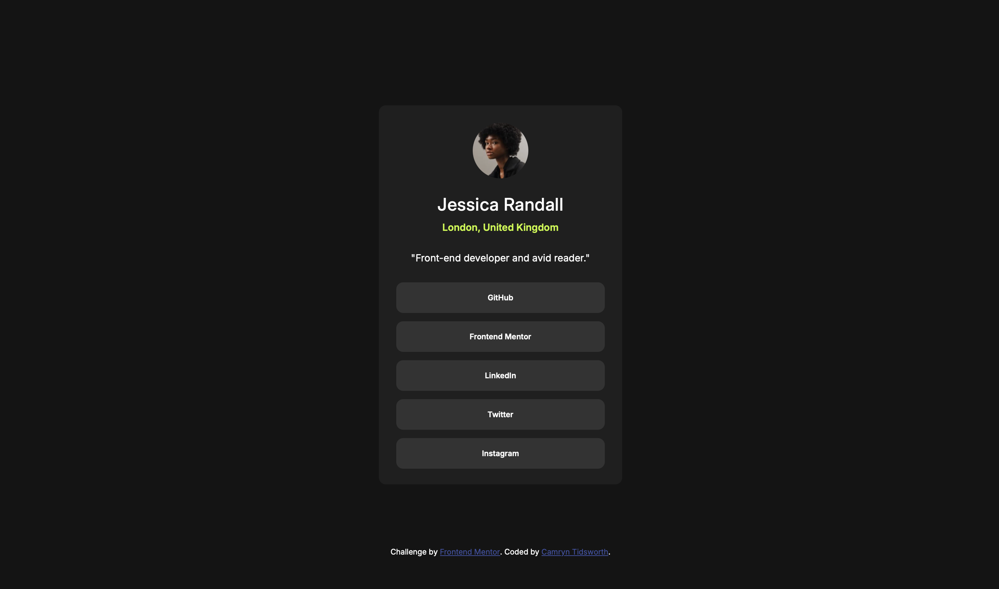

# Frontend Mentor - Social links profile solution

This is a solution to the [Social links profile challenge on Frontend Mentor](https://www.frontendmentor.io/challenges/social-links-profile-UG32l9m6dQ). Frontend Mentor challenges help you improve your coding skills by building realistic projects. 

## Table of contents

- [Overview](#overview)
  - [The challenge](#the-challenge)
  - [Screenshot](#screenshot)
  - [Links](#links)
- [My process](#my-process)
  - [Built with](#built-with)
  - [What I learned](#what-i-learned)
  - [Continued development](#continued-development)
- [Author](#author)

## Overview

### The challenge

Users should be able to:

- See hover and focus states for all interactive elements on the page

### Screenshot

### Links

- Solution URL: [Add solution URL here](https://your-solution-url.com)
- Live Site URL: [Add live site URL here](https://your-live-site-url.com)

## My process

### Built with

- Semantic HTML5 markup
- CSS custom properties
- Flexbox

### What I learned

I realized I could position my main container by formatting the body with flexbox, instead of adding an extra div to act as a wrapper. This simplified my code and helped me get a stronger grasp on flexbox. 

### Continued development

I feel comfortable with all the concepts used in this project. My next goal is to apply these concepts (CSS variables, flexbox positioning, etc.) to a more complex web page. 

## Author

- Frontend Mentor - [@CamrynTidsworth](https://www.frontendmentor.io/profile/CamrynTidsworth)
